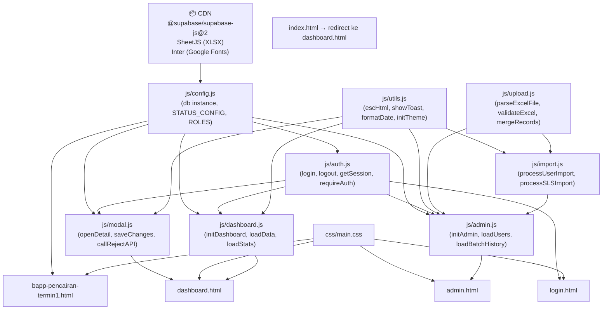

# Dependency Map — Anomali SE2026 Dashboard

> Analisis lengkap seluruh file, function, tabel, API, session, dan cookie yang digunakan dalam project ini.

---

## 1. Struktur File & Dependency Antar File



### Tabel: File A memanggil File B

| File (Halaman/Script) | Memanggil (script src / import) |
|---|---|
| `login.html` | `cdn @supabase/supabase-js@2`, `js/config.js`, `js/auth.js`, `css/main.css`, Google Fonts Inter |
| `dashboard.html` | `cdn @supabase/supabase-js@2`, `cdn SheetJS (XLSX)`, `js/config.js`, `js/utils.js`, `js/auth.js`, `js/upload.js`, `js/modal.js`, `js/dashboard.js`, `css/main.css`, Google Fonts Inter |
| `admin.html` | `cdn @supabase/supabase-js@2`, `cdn SheetJS (XLSX)`, `js/config.js`, `js/utils.js`, `js/auth.js`, `js/upload.js`, `js/import.js`, `js/admin.js`, `css/main.css`, Google Fonts Inter |
| `bapp-pencairan-termin1.html` | `cdn @supabase/supabase-js@2`, `js/config.js`, `css/main.css`, Google Fonts Inter |
| `index.html` | *(tidak ada script/link eksternal — hanya inline redirect)* |
| `js/admin.js` | Bergantung pada: `config.js` (db, getSessionName), `utils.js` (escHtml, showToast, formatDate, renderValidationResult, setZoneFile), `auth.js` (requireAuth, getSession, logout), `upload.js` (parseExcelFile, validateExcel, rowsToRecordsFull, mergeRecords, checkSLSConsistency, generateTemplate), `import.js` (processUserImport, processSLSImport, showSection, loadUsers) |
| `js/dashboard.js` | Bergantung pada: `config.js` (db, STATUS_CONFIG, buildFasihLink), `utils.js` (escHtml, showToast, formatDate, initTheme, toggleTheme), `auth.js` (getSession, logout, getSessionName) |
| `js/modal.js` | Bergantung pada: `config.js` (db, STATUS_CONFIG, buildFasihLink), `utils.js` (escHtml, showToast, formatDate), `auth.js` (canEditSLS, getSessionName) |
| `js/import.js` | Bergantung pada: `utils.js` (escHtml, showToast, renderValidationResult, setZoneFile, validateHeaders), `upload.js` (parseExcelFile), `auth.js` (toAuthEmail) |

---

## 2. Function Call Map (A memanggil B)

### `js/auth.js`

| Function | Memanggil |
|---|---|
| `login(username, password)` | `db.rpc('resolve_auth_email')`, `db.auth.signInWithPassword()` |
| `logout()` | `sessionStorage.removeItem('admin_session_name')`, `db.auth.signOut()`, `window.location.href` |
| `getSession()` | `db.auth.getSession()`, `db.from('profiles').select().eq().single()` |
| `getSessionName(profile)` | `sessionStorage.getItem('admin_session_name')` |
| `requireAuth(allowedRoles)` | `getSession()`, `logout()`, `showAdminNameModal()` |
| `showAdminNameModal(profile)` | `document.getElementById('adminNameModal')` |
| `submitAdminName(name)` | `sessionStorage.setItem('admin_session_name')` |
| `canEditSLS(kode_sls_gabungan, profile)` | `db.rpc('get_pml_sls')`, `db.rpc('get_my_sls')` |

### `js/utils.js`

| Function | Memanggil |
|---|---|
| `escHtml(str)` | *(pure utility)* |
| `showToast(message, type, duration)` | `document.getElementById('toastContainer')`, `escHtml()` |
| `formatDate(dateStr, withTime)` | `new Date().toLocaleDateString('id-ID')` |
| `initTheme()` | `localStorage.getItem('theme')`, `window.matchMedia()` |
| `toggleTheme()` | `localStorage.setItem('theme')` |
| `validateHeaders(headerRow, expectedCols)` | *(pure utility)* |
| `setZoneFile(zoneId, labelId, fileName, hasFile)` | `document.getElementById()` |
| `renderValidationResult(containerId, result)` | `escHtml()` |

### `js/upload.js`

| Function | Memanggil |
|---|---|
| `parseExcelFile(file)` | `XLSX.read()`, `XLSX.utils.sheet_to_json()`, `FileReader` |
| `validateExcel(rows, tipe)` | *(pure utility — tidak ada DB call)* |
| `parseAnomaliName(namaStr, tipe)` | *(pure utility)* |
| `mapTindakLanjutToStatus(val)` | *(pure utility)* |
| `rowsToRecordsFull(rows, tipe, tanggalData)` | `parseAnomaliName()`, `mapTindakLanjutToStatus()` |
| `checkSLSConsistency(kkRecords, usahaRecords)` | *(pure utility)* |
| `mergeRecords(records, batchId, tanggalData, onProgress)` | `db.rpc('merge_anomali_batch')`, `db.rpc('resolve_unseen_anomali')` |
| `generateTemplate(tipe)` | `XLSX.utils.book_new()`, `XLSX.utils.aoa_to_sheet()`, `XLSX.writeFile()` |

### `js/import.js`

| Function | Memanggil |
|---|---|
| `generateUserTemplate()` | `XLSX.utils.book_new()`, `XLSX.writeFile()` |
| `processUserFile(file)` | `parseExcelFile()`, `validateUserExcel()`, `db.from('profiles').select()`, `setZoneFile()`, `renderValidationResult()`, `escHtml()` |
| `validateUserExcel(rows)` | `validateHeaders()` |
| `processUserImport(confirm)` | `db.rpc('register_users_batch')`, `showToast()`, `setZoneFile()`, `showSection()`, `loadUsers()`, `closeOverwriteModal()`, `escHtml()` |
| `closeOverwriteModal()` | `document.getElementById('confirmOverwriteModal')` |
| `processSLSFile(file)` | `parseExcelFile()`, `validateSLSExcel()`, `setZoneFile()`, `renderValidationResult()`, `escHtml()` |
| `validateSLSExcel(rows)` | `validateHeaders()` |
| `processSLSImport()` | `db.rpc('import_sls_batch')`, `showToast()`, `setZoneFile()`, `showSection()`, `loadUsers()`, `escHtml()` |
| `generateWilayahTemplate()` | `XLSX.utils.book_new()`, `XLSX.writeFile()` |

### `js/modal.js`

| Function | Memanggil |
|---|---|
| `openDetail(assignmentId)` | `canEditSLS()`, `buildFasihLink()`, `renderSheetBody()` |
| `renderSheetBody()` | `db.from('assignment_anomali').select()`, `db.from('anomali_ref').select()`, `db.from('status_history').select()`, `db.from('master_wilayah').select()`, `renderAnomaliItem()`, `formatDate()`, `escHtml()` |
| `renderAnomaliItem(row, refMap, historyList)` | `STATUS_CONFIG`, `escHtml()`, `formatDate()` |
| `saveChanges()` | `getSessionName()`, `db.from('assignment_anomali').select()`, `db.from('assignment_anomali').update()`, `db.from('status_history').insert()`, `showToast()`, `closeDetailModal()`, `loadData()`, `loadStats()`, `openLoginModal()` |
| `openBulkModal()` | `renderBulkSheetBody()` |
| `saveBulkChanges()` | `getSessionName()`, `db.from('assignment_anomali').update()`, `showToast()`, `clearSelection()`, `closeBulkModal()`, `loadData()`, `loadStats()` |
| `handleModalLoginSubmit()` | `db.rpc('resolve_auth_email')`, `db.auth.signInWithPassword()`, `db.from('profiles').select()`, `getSessionName()`, `canEditSLS()`, `showToast()`, `closeLoginModal()` |
| `callRejectAPI(assignmentId)` | `fetch('https://fasih-sm.bps.go.id/app/api/assignment-approval/api/v2/approval')`, `showToast()` |
| `rejectIndividualAssignment()` | `callRejectAPI()` |
| `rejectAllBulkAssignments()` | `callRejectAPI()`, `showToast()` |

### `js/dashboard.js`

| Function | Memanggil |
|---|---|
| `initDashboard()` | `getSession()`, `getSessionName()`, `loadStats()`, `loadAnomalinomorOptions()`, `loadWilayahOptions()`, `loadKecamatanProgress()`, `loadData()` |
| `loadStats()` | `db.rpc('get_dashboard_stats')`, `db.from('assignment_anomali').select()`, `db.from('user_sls').select()`, `db.from('pml_ppl').select()`, `renderStats()` |
| `loadData()` | `db.rpc('get_both_type_anomalies')`, `db.rpc('get_my_sls')`, `db.rpc('get_pml_sls')`, `db.rpc('get_petugas_sls')`, `db.from('assignment_anomali').select()`, `db.from('user_sls').select()`, `db.from('pml_ppl').select()`, `groupByAssignment()`, `applyFilters()`, `renderAll()` |
| `loadAnomalinomorOptions()` | `db.from('anomali_ref').select()` |
| `loadWilayahOptions()` | `db.from('wilayah_kec').select()` |
| `onKecamatanChange()` | `db.from('wilayah_desa').select()` |
| `onDesaChange()` | `db.from('wilayah_sls').select()` |
| `onSLSChange()` | `db.from('wilayah_subsls').select()` |
| `loadKecamatanProgress()` | `db.rpc('get_kecamatan_progress')`, `renderKecamatanProgress()` |
| `onPetugasSearchInput(val)` | `db.rpc('search_petugas')`, `db.from('profiles').select()` (fallback), `escHtml()` |
| `applyFilters()` | `loadStats()`, `loadAnomalinomorOptions()`, `loadData()`, `renderKecamatanProgress()` |

### `js/admin.js`

| Function | Memanggil |
|---|---|
| `initAdmin()` | `requireAuth()`, `getSessionName()`, `loadBatchHistory()`, `loadAnomaliRef()`, `loadUsers()`, `loadUnassigned()`, `loadWilayah()`, `loadBAPPKecamatanFilter()`, `showSection()` |
| `processFile(file, tipe)` | `parseExcelFile()`, `validateExcel()`, `rowsToRecordsFull()`, `renderValidationResult()`, `checkValidateBtn()`, `escHtml()` |
| `startMerge()` | `db.from('upload_batches').insert()`, `mergeRecords()`, `db.from('upload_batches').update()`, `showToast()`, `loadBatchHistory()`, `checkMissingReferences()`, `escHtml()` |
| `checkMissingReferences(allRecords)` | `db.from('anomali_ref').select()` |
| `loadBatchHistory()` | `db.from('upload_batches').select()`, `escHtml()`, `formatDate()` |
| `loadAnomaliRef()` | `db.from('anomali_ref').select()`, `escHtml()` |
| `saveAnomaliRef()` | `db.from('anomali_ref').update()`, `db.from('anomali_ref').insert()`, `showToast()`, `loadAnomaliRef()` |
| `deleteAnomaliRef(id)` | `db.from('anomali_ref').delete()`, `showToast()`, `loadAnomaliRef()` |
| `loadUsers()` | `db.from('profiles').select()`, `db.from('user_sls').select()`, `db.from('pml_ppl').select()`, `db.rpc('get_anomaly_counts_by_sls')`, `db.from('wilayah_kec').select()`, `filterUsers()` |
| `createUser()` | `db.rpc('register_users_batch')`, `showToast()`, `loadUsers()` |
| `toggleUserStatus(userId)` | `db.from('profiles').update()`, `showToast()`, `loadUsers()` |
| `manageUserSLS(userId, nama)` | `db.from('user_sls').upsert()`, `showToast()`, `loadUsers()` |
| `assignSLStoPPL(kodeSLS)` | `db.from('profiles').select()`, `db.from('user_sls').upsert()`, `showToast()`, `loadUnassigned()` |
| `loadUnassigned()` | `db.rpc('get_unassigned_sls_summary')` |
| `loadWilayah()` | `db.from('master_wilayah').select()`, `filterWilayah()` |
| `uploadMasterWilayah()` | `db.rpc('import_master_wilayah_batch')`, `showToast()`, `loadWilayah()` |
| `loadBAPPData()` | `db.from('bapp_uploads').select()` |
| `loadBAPPKecamatanFilter()` | `db.from('wilayah_kec').select()` |
| `printBAPP(rows)` | `window.open()`, `escHtml()` |

### `bapp-pencairan-termin1.html` (inline script)

| Function | Memanggil |
|---|---|
| `DOMContentLoaded` (init) | `db.from('wilayah_kec').select()` |
| `handlePetugasSearch(val)` | `db.rpc('search_petugas_by_kec')` |
| `handleSubmit(e)` | `db.from('bapp_uploads').upsert()`, `showToast()` |

---

## 3. Kelas / Object yang Digunakan

| Kelas / Object | Sumber | Digunakan Di |
|---|---|---|
| `supabase.createClient` | CDN `@supabase/supabase-js@2` | `config.js` → membuat instance `db` |
| `db` (Supabase client) | `config.js` | Semua file JS |
| `XLSX` | CDN SheetJS | `upload.js`, `import.js`, `admin.js` |
| `FileReader` | Browser API | `upload.js` → `parseExcelFile()` |
| `Set` | JavaScript Built-in | `dashboard.js` (selectedIds, SLS codes) |
| `Map/Object` | JavaScript Built-in | Semua file (grouping, lookup maps) |
| `Promise` | JavaScript Built-in | `upload.js` → `parseExcelFile()` |
| `STATUS_CONFIG` | `config.js` | `modal.js`, `dashboard.js` |
| `ROLES` | `config.js` | *(defined but not explicitly used via ROLES constant — role strings used directly)* |

---

## 4. Helper yang Digunakan

| Helper | Didefinisikan Di | Digunakan Di |
|---|---|---|
| `escHtml()` | `utils.js` | `dashboard.js`, `admin.js`, `modal.js`, `import.js`, `bapp-pencairan-termin1.html` (re-defined inline) |
| `showToast()` | `utils.js` | `dashboard.js`, `admin.js`, `modal.js`, `import.js` |
| `formatDate()` | `utils.js` | `modal.js`, `admin.js`, `dashboard.js` |
| `initTheme()` | `utils.js` | `dashboard.js`, `admin.js`; juga **re-defined inline** di `login.html` |
| `toggleTheme()` | `utils.js` | `dashboard.html`, `admin.html`; juga **re-defined inline** di `login.html` |
| `validateHeaders()` | `utils.js` | `import.js` |
| `setZoneFile()` | `utils.js` | `import.js` |
| `renderValidationResult()` | `utils.js` | `import.js`, `admin.js` |
| `buildFasihLink()` | `config.js` | `modal.js`, `dashboard.js` |
| `buildSLSCode()` | `config.js` | *(defined — belum digunakan secara eksplisit di tempat lain)* |
| `login()` | `auth.js` | `login.html` |
| `logout()` | `auth.js` | `login.html`, `dashboard.js`, `auth.js` (di dalam requireAuth) |
| `getSession()` | `auth.js` | `login.html`, `dashboard.js`, `admin.js` |
| `requireAuth()` | `auth.js` | `admin.js` |
| `getSessionName()` | `auth.js` | `modal.js`, `admin.js`, `dashboard.js` |
| `canEditSLS()` | `auth.js` | `modal.js` |
| `submitAdminName()` | `auth.js` | `login.html` |
| `parseExcelFile()` | `upload.js` | `admin.js`, `import.js` |
| `validateExcel()` | `upload.js` | `admin.js` |
| `rowsToRecordsFull()` | `upload.js` | `admin.js` |
| `mergeRecords()` | `upload.js` | `admin.js` |
| `checkSLSConsistency()` | `upload.js` | `admin.js` |
| `generateTemplate()` | `upload.js` | `admin.js` (inline call dari tombol HTML) |
| `groupByAssignment()` | `dashboard.js` | `dashboard.js` (internal) |
| `loadData()` / `loadStats()` | `dashboard.js` | `modal.js` (setelah save), `dashboard.js` |
| `clearSelection()` | `dashboard.js` | `modal.js` |
| `openDetail()` | `modal.js` | `dashboard.html` (onclick) |
| `showSection()` | `admin.js` | `import.js` |
| `loadUsers()` | `admin.js` | `import.js` |

---

## 5. API yang Dipanggil

### Supabase REST API (via `db.from()`)

| Endpoint / Tabel | Method | File Pemanggil | Keterangan |
|---|---|---|---|
| `profiles` | SELECT | `auth.js`, `dashboard.js`, `admin.js`, `modal.js`, `login.html`, `import.js` | Ambil profil user |
| `profiles` | UPDATE | `admin.js` | Toggle `is_active` |
| `assignment_anomali` | SELECT | `dashboard.js`, `modal.js` | Ambil data anomali |
| `assignment_anomali` | UPDATE | `modal.js` | Update status/catatan/show_anomaly/is_rejected |
| `anomali_ref` | SELECT | `dashboard.js`, `admin.js`, `modal.js` | Referensi anomali |
| `anomali_ref` | INSERT/UPDATE/DELETE | `admin.js` | CRUD CMS anomali |
| `upload_batches` | INSERT | `admin.js` | Buat batch baru |
| `upload_batches` | SELECT | `admin.js` | Riwayat upload |
| `upload_batches` | UPDATE | `admin.js` | Update status batch |
| `status_history` | SELECT | `modal.js` | Riwayat perubahan status |
| `status_history` | INSERT | `modal.js` | Catat perubahan manual |
| `user_sls` | SELECT | `admin.js`, `dashboard.js` | SLS per PPL |
| `user_sls` | UPSERT | `admin.js` | Assign SLS ke PPL |
| `pml_ppl` | SELECT | `admin.js`, `dashboard.js` | Hubungan PML-PPL |
| `master_wilayah` (VIEW) | SELECT | `modal.js`, `admin.js` | Nama wilayah dari view |
| `wilayah_kec` | SELECT | `dashboard.js`, `admin.js`, `bapp-pencairan-termin1.html` | Daftar kecamatan |
| `wilayah_desa` | SELECT | `dashboard.js` | Daftar desa (cascade filter) |
| `wilayah_sls` | SELECT | `dashboard.js` | Daftar SLS (cascade filter) |
| `wilayah_subsls` | SELECT | `dashboard.js` | Daftar sub-SLS (cascade filter) |
| `bapp_uploads` | SELECT | `admin.js` | Daftar upload BAPP |
| `bapp_uploads` | UPSERT | `bapp-pencairan-termin1.html` | Upload/update screenshot BAPP |

### Supabase RPC (via `db.rpc()`)

| Nama Fungsi | Pemanggil | Keterangan |
|---|---|---|
| `resolve_auth_email` | `auth.js`, `modal.js` | Cari email auth dari email referensi |
| `get_my_sls` | `auth.js`, `dashboard.js` | SLS milik PPL yang login |
| `get_pml_sls` | `auth.js`, `dashboard.js` | SLS di bawah PML yang login |
| `get_petugas_sls` | `dashboard.js` | SLS berdasarkan petugas (PPL/PML) |
| `get_dashboard_stats` | `dashboard.js` | Statistik ringkasan dashboard |
| `get_kecamatan_progress` | `dashboard.js` | Progress per kecamatan |
| `get_both_type_anomalies` | `dashboard.js` | Anomali yang punya keduanya (keluarga & usaha) |
| `get_anomaly_counts_by_sls` | `admin.js` | Jumlah anomali per SLS |
| `get_unassigned_sls_summary` | `admin.js` | SLS tanpa PPL yang di-assign |
| `merge_anomali_batch` | `upload.js` | Merge/upsert anomali dari file Excel |
| `resolve_unseen_anomali` | `upload.js` | Auto-resolve anomali yang tidak muncul di upload baru |
| `register_users_batch` | `import.js`, `admin.js` | Daftar/update user secara massal |
| `import_sls_batch` | `import.js` | Import mapping SLS ke PPL/PML |
| `import_master_wilayah_batch` | `admin.js` | Import master wilayah |
| `search_petugas` | `dashboard.js` | Cari petugas (PPL/PML) untuk filter |
| `search_petugas_by_kec` | `bapp-pencairan-termin1.html` | Cari petugas berdasarkan kecamatan |

### Supabase Auth API (via `db.auth.*`)

| Method | Pemanggil | Keterangan |
|---|---|---|
| `db.auth.getSession()` | `auth.js` → `getSession()` | Cek session aktif |
| `db.auth.signInWithPassword()` | `auth.js` → `login()`, `modal.js` → `handleModalLoginSubmit()` | Login dengan email+password |
| `db.auth.signOut()` | `auth.js` → `logout()` | Logout |

### Fasih-SM External API

| URL | Method | Pemanggil | Keterangan |
|---|---|---|---|
| `https://fasih-sm.bps.go.id/app/api/assignment-approval/api/v2/approval` | POST | `modal.js` → `callRejectAPI()` | Reject assignment di Fasih-SM |

---

## 6. Database yang Digunakan

| Database | Provider | URL |
|---|---|---|
| **Supabase PostgreSQL** | Supabase.co | `https://vpbhqemomsewrnrggbmd.supabase.co` |

**Auth Method:** Supabase Auth (email/password), dengan email convention `{sobatid}@anomali3602.se`

---

## 7. Tabel Database yang Digunakan

### Tabel Utama (`public` schema)

| Nama Tabel | Deskripsi | Primary Key | Digunakan Di |
|---|---|---|---|
| `profiles` | Profil pengguna (PPL, PML, Admin, Superadmin) | `id` (UUID, FK → `auth.users`) | `auth.js`, `dashboard.js`, `admin.js`, `modal.js`, `login.html`, `import.js` |
| `assignment_anomali` | Data anomali utama per assignment | `id` (UUID) | `dashboard.js`, `modal.js`, `admin.js` |
| `status_history` | Riwayat perubahan status anomali | `id` (UUID) | `modal.js` |
| `anomali_ref` | Referensi/kamus anomali (CMS) | `id` (SERIAL) | `dashboard.js`, `admin.js`, `modal.js` |
| `upload_batches` | Riwayat upload file Excel | `id` (UUID) | `admin.js` |
| `user_sls` | Mapping PPL → SLS yang di-handle | `id` (UUID) | `admin.js`, `dashboard.js` |
| `pml_ppl` | Mapping PML → PPL (hubungan supervisi) | `(pml_id, ppl_id)` | `admin.js`, `dashboard.js` |
| `bapp_uploads` | Screenshot BAPP per petugas | `id` (UUID) | `admin.js`, `bapp-pencairan-termin1.html` |
| `wilayah_kec` | Master Kecamatan | `kode_kec` (VARCHAR 7) | `dashboard.js`, `admin.js`, `bapp-pencairan-termin1.html` |
| `wilayah_desa` | Master Desa/Kelurahan | `kode_desa` (VARCHAR 10) | `dashboard.js`, `admin.js` |
| `wilayah_sls` | Master SLS (Satuan Lingkungan Setempat) | `kode_sls` (VARCHAR 14) | `dashboard.js` |
| `wilayah_subsls` | Master Sub-SLS | `kode_sls_gabungan` (VARCHAR 16) | `dashboard.js` |

### View Database

| Nama View | Deskripsi | Digunakan Di |
|---|---|---|
| `master_wilayah` | Denormalized view gabungan wilayah (kec→desa→sls→subsls) | `modal.js`, `admin.js` |

### Tabel Internal Supabase (Auth)

| Tabel | Digunakan Di | Keterangan |
|---|---|---|
| `auth.users` | `register_users_batch` (SQL function) | Insert user baru langsung ke auth |
| `auth.identities` | `register_users_batch` (SQL function) | Insert identity email |

---

## 8. Session yang Digunakan

| Key | Storage | Scope | Diatur Oleh | Dibaca Oleh |
|---|---|---|---|---|
| `admin_session_name` | `sessionStorage` | Per-tab browser | `auth.js` → `submitAdminName()` | `auth.js` → `getSessionName()`, `login.html`, `dashboard.js`, `admin.js` |
| Supabase Session Token | `localStorage` (otomatis oleh Supabase SDK) | Browser | `db.auth.signInWithPassword()` | `db.auth.getSession()` |

**Catatan:** Supabase client dikonfigurasi dengan `persistSession: true` di `config.js`, sehingga session token JWT otomatis disimpan di `localStorage` oleh Supabase SDK (bukan manual oleh kode aplikasi).

---

## 9. Cookie yang Digunakan

> **Tidak ada cookie yang di-set secara eksplisit** oleh kode aplikasi ini.

Supabase SDK menyimpan session di **`localStorage`**, bukan cookie. Satu-satunya relevansi cookie adalah:

| Cookie | Source | Keterangan |
|---|---|---|
| Cookie Fasih-SM | Browser (third-party) | Digunakan saat `callRejectAPI()` mengirim request ke `fasih-sm.bps.go.id` dengan `credentials: 'include'` — membutuhkan user sudah login di Fasih-SM di browser yang sama |

---

## 10. Dependency yang Berisiko Apabila Diubah

### 🔴 KRITIS — Perubahan akan merusak banyak bagian sekaligus

| Komponen | Risiko | File yang Terdampak |
|---|---|---|
| **`js/config.js` → `db` (Supabase instance)** | Seluruh aplikasi bergantung pada `db`. Jika URL, Key, atau cara inisialisasi berubah, **semua** operasi database gagal. | `auth.js`, `dashboard.js`, `admin.js`, `modal.js`, `import.js`, `upload.js`, `bapp-pencairan-termin1.html` |
| **`js/config.js` → `STATUS_CONFIG`** | Digunakan untuk rendering label status, warna badge, dan filter. Jika key status berubah (misal `belum_ditindaklanjuti`), semua tampilan status rusak. | `modal.js`, `dashboard.js`, dan tabel DB (`assignment_anomali.status` CHECK constraint) |
| **Schema tabel `profiles` (kolom `role`)** | Seluruh alur auth & otorisasi bergantung pada nilai `role` (`superadmin`, `admin`, `pml`, `ppl`). Jika nama role berubah di DB, semua kondisi `if/else` berbasis role di semua file akan salah. | `auth.js`, `dashboard.js`, `admin.js`, `modal.js`, `import.js`, `login.html` |
| **Schema tabel `assignment_anomali` (kolom `status`)** | Nilai status dikodekan keras di banyak tempat (filter, render, SQL functions). Jika nilai `CHECK` constraint berubah, semua filter dan tampilan rusak. | `dashboard.js`, `modal.js`, `upload.js`, semua SQL functions |
| **Fungsi `register_users_batch` (Supabase RPC)** | Menulis langsung ke `auth.users` dan `auth.identities` (internal Supabase). Jika skema internal Supabase berubah (update versi), fungsi ini akan **gagal diam-diam** atau error. | `import.js`, `admin.js` |

### 🟠 TINGGI — Perubahan akan merusak fitur penting

| Komponen | Risiko | File yang Terdampak |
|---|---|---|
| **`js/auth.js` → `getSession()`** | Dipanggil di titik masuk semua halaman. Jika signature/return berubah, semua halaman tidak bisa mendeteksi user. | `login.html`, `dashboard.js`, `admin.js` |
| **`js/utils.js` → `showToast()`** | Membutuhkan elemen `#toastContainer` di setiap halaman HTML. Jika ID elemen berubah, semua notifikasi hilang. | Semua halaman & file JS |
| **`js/utils.js` → `escHtml()`** | Dipakai di setiap tempat yang render string ke HTML. Jika dihapus atau diubah signature-nya, semua render string akan gagal. | Semua file JS |
| **`js/utils.js` → `initTheme()`** | Didefinisikan di `utils.js` tapi juga **diduplikasi secara inline** di `login.html`. Jika diubah di `utils.js` tapi tidak di `login.html`, perilaku tema akan berbeda antar halaman. | `login.html` (bug duplikasi), `dashboard.js`, `admin.js` |
| **Fungsi RPC `merge_anomali_batch`** | Melakukan upsert ke 5 tabel sekaligus (`anomali_ref`, `wilayah_kec/desa/sls/subsls`, `assignment_anomali`, `status_history`). Jika ada perubahan pada salah satu tabel terkait, seluruh proses upload data akan gagal. | `upload.js`, `admin.js` |
| **Kolom `kode_sls_gabungan` (generated column)** | Kolom ini dikomputasi (`kode_desa || kode_sls || kode_sub_sls`) dan merupakan primary filter di hampir semua query. Jika logika generasi berubah, semua filter wilayah akan salah. | `dashboard.js`, `modal.js`, `auth.js`, semua SQL functions |
| **Format email auth (`{sobatid}@anomali3602.se`)** | Domain email ini dikodekan keras di `auth.js`, `modal.js`, dan SQL function `register_users_batch`. Jika domain berubah, semua login gagal. | `auth.js`, `modal.js`, SQL `register_users_batch` |

### 🟡 MENENGAH — Perubahan akan merusak fitur spesifik

| Komponen | Risiko | File yang Terdampak |
|---|---|---|
| **`js/upload.js` → `EXPECTED_COLS_USAHA` / `EXPECTED_COLS_KELUARGA`** | Urutan kolom dikodekan keras. Jika template Excel resmi berubah urutan kolom, validasi akan gagal meskipun isinya benar. | `upload.js` (validateExcel, rowsToRecordsFull) |
| **Fungsi RPC `get_dashboard_stats`** | Ada fallback query jika RPC tidak tersedia, tapi fallback tidak akurat untuk semua role. Jika RPC dihapus dari DB, statistik dashboard tidak akurat. | `dashboard.js` |
| **`callRejectAPI()` di `modal.js`** | Memanggil API eksternal Fasih-SM dengan `credentials: 'include'`. Bergantung pada: (1) user sudah login di Fasih-SM, (2) browser mengizinkan cross-origin cookies, (3) endpoint API Fasih-SM tidak berubah. Sangat rapuh. | `modal.js` |
| **`bapp_uploads.screenshot` (Base64 TEXT)** | Screenshot disimpan sebagai string Base64 langsung di kolom TEXT. Ini tidak scalable — bisa menyebabkan performa lambat seiring bertambahnya data. Jika diubah ke Storage URL, semua kode yang membaca `item.screenshot` langsung akan rusak. | `admin.js` → `showScreenshot()`, `printBAPP()` |
| **View `master_wilayah`** | Digunakan di `modal.js` untuk menampilkan alamat dan di `admin.js` untuk tabel wilayah. Jika tabel wilayah yang mendasari (kec/desa/sls/subsls) berubah skema, view akan error. | `modal.js`, `admin.js` |
| **`sessionStorage` key `admin_session_name`** | Jika nama key ini berubah di satu tempat tapi tidak di tempat lain, admin tidak bisa masuk (redirect loop). | `auth.js`, `login.html`, `dashboard.js`, `admin.js` |
| **`buildFasihLink()` di `config.js`** | URL hardcoded ke `fasih-sm.bps.go.id` dengan UUID survey tertentu (`fd68e454-ba45-4b85-8205-f3bf777ded24`). Jika UUID survey berubah, semua link ke Fasih-SM akan salah. | `modal.js`, `dashboard.js` |

---

## 11. Ringkasan Dependency Paling Berbahaya

```
config.js (db) ─────────────────────────────► SEMUA FILE
   └─ Jika Supabase URL/Key berubah: SEMUA QUERY GAGAL

profiles.role values ────────────────────────► SEMUA ALUR AUTH
   └─ Jika nama role berubah di DB: SELURUH OTORISASI RUSAK

assignment_anomali.status CHECK values ──────► DASHBOARD + MODAL + SQL
   └─ Jika nilai status berubah: FILTER + RENDER RUSAK

register_users_batch (RPC) ──────────────────► auth.users (internal Supabase)
   └─ Bergantung undocumented internal schema Supabase

callRejectAPI() ─────────────────────────────► fasih-sm.bps.go.id (cross-origin)
   └─ Bergantung CORS + cookie Fasih-SM + endpoint eksternal

initTheme() duplikasi di login.html ─────────► Tema login berbeda dari halaman lain
   └─ Perlu diupdate di 2 tempat jika ada perubahan
```
