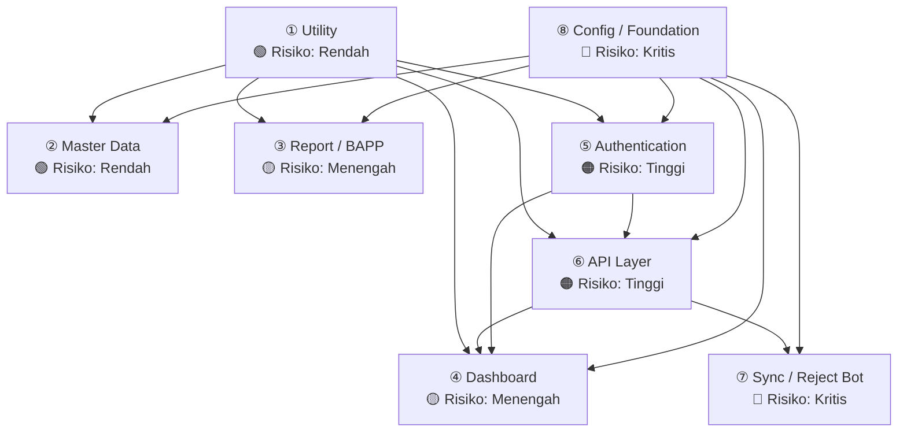

# Module Breakdown — Anomali SE2026

> Diurutkan dari **risiko paling kecil → paling besar**.  
> Setiap modul dianalisis: file, dependency, risiko saat ini, dan prioritas refactor.

---

## Ikhtisar Modul



---

## ① Modul: Utility

**Risiko: 🟢 RENDAH | Prioritas Refactor: Rendah (tapi mudah dilakukan)**

### File yang Termasuk

| File | Peran |
|---|---|
| `js/utils.js` | Helper umum: escHtml, showToast, formatDate, initTheme, toggleTheme, validateHeaders, setZoneFile, renderValidationResult |

### Dependency

```
utils.js
  ├── TIDAK bergantung pada modul lain (zero dependency)
  └── CDN: Tidak ada
```

- **Digunakan oleh:** `auth.js`, `dashboard.js`, `admin.js`, `modal.js`, `import.js`

### Masalah yang Ditemukan

| # | Masalah | Dampak |
|---|---|---|
| 1 | `initTheme()` dan `toggleTheme()` **diduplikasi secara inline** di `login.html` | Jika diubah di `utils.js`, perilaku di `login.html` tidak ikut berubah |
| 2 | `escHtml()` juga **diduplikasi inline** di `bapp-pencairan-termin1.html` | Idem |
| 3 | `showToast()` mengasumsikan `#toastContainer` selalu ada di DOM | Tidak ada graceful fallback jika elemen tidak ditemukan |

### Prioritas Refactor

```
✅ BISA DILAKUKAN KAPAN SAJA — tidak ada risiko pecahkan sistem
Langkah: Hapus duplikasi inline di login.html dan bapp*.html,
          ganti dengan <script src="js/utils.js">
```

---

## ② Modul: Master Data

**Risiko: 🟢 RENDAH | Prioritas Refactor: Rendah**

### File yang Termasuk

| File | Peran |
|---|---|
| `js/admin.js` (bagian Wilayah) | CRUD master wilayah, filter, pagination |
| `js/import.js` (bagian SLS) | Import mapping SLS dari Excel |
| `sql/schema.sql` (tabel wilayah) | DDL: `wilayah_kec`, `wilayah_desa`, `wilayah_sls`, `wilayah_subsls`, `master_wilayah` (view), RPC `import_master_wilayah_batch`, `import_sls_batch` |
| `sql/schema.sql` (tabel user) | DDL: `profiles`, `user_sls`, `pml_ppl`, RPC `register_users_batch` |

### Dependency

```
Master Data
  ├── config.js (db instance)
  ├── utils.js (escHtml, showToast, validateHeaders, setZoneFile)
  └── upload.js (parseExcelFile — untuk baca Excel)
```

**Tabel yang diakses:**
- `wilayah_kec`, `wilayah_desa`, `wilayah_sls`, `wilayah_subsls`, `master_wilayah` (VIEW)
- `profiles`, `user_sls`, `pml_ppl`

**RPC yang dipanggil:**
- `import_master_wilayah_batch`, `import_sls_batch`, `register_users_batch`, `get_anomaly_counts_by_sls`, `get_unassigned_sls_summary`

### Masalah yang Ditemukan

| # | Masalah | Dampak |
|---|---|---|
| 1 | `register_users_batch` menulis langsung ke `auth.users` dan `auth.identities` (internal Supabase) | Bergantung undocumented schema — bisa rusak setelah upgrade Supabase |
| 2 | Format email hardcoded: `{sobatid}@anomali3602.se` di SQL function | Jika domain diganti, semua user lama tidak bisa login |
| 3 | Logic `loadUsers()` di `admin.js` mensegmentasi SLS dan PML-PPL di memori (JavaScript) setelah fetch semua data | Tidak scalable jika data sudah ribuan baris |

### Prioritas Refactor

```
⚠️ SEDANG — Refactor register_users_batch agar tidak bergantung
            pada internal auth.users schema.
            Pisahkan loadUsers() ke fungsi dedicated.
```

---

## ③ Modul: Report / BAPP

**Risiko: 🟡 MENENGAH | Prioritas Refactor: Menengah**

### File yang Termasuk

| File | Peran |
|---|---|
| `bapp-pencairan-termin1.html` | Halaman publik upload screenshot BAPP — self-contained (inline script) |
| `js/admin.js` (bagian BAPP) | loadBAPPData, filterBAPP, renderBAPPTable, showScreenshot, printBAPP, printSingleBAPP, printSelectedBAPP |
| `sql/bapp_uploads_schema.sql` | DDL: `bapp_uploads`, RLS policies, `get_public_petugas_list()`, `search_petugas_by_kec()` |

### Dependency

```
Report / BAPP
  ├── config.js (db instance)
  ├── utils.js (escHtml, showToast, formatDate)
  ├── Tabel: bapp_uploads, profiles (join), wilayah_kec (join)
  └── RPC: search_petugas_by_kec (dari bapp-pencairan-termin1.html)
```

### Masalah yang Ditemukan

| # | Masalah | Dampak |
|---|---|---|
| 1 | `bapp_uploads.screenshot` menyimpan **gambar Base64 langsung di kolom TEXT** database | Performa lambat, konsumsi storage tidak efisien, tidak scalable |
| 2 | `bapp-pencairan-termin1.html` adalah file HTML **standalone** yang tidak menggunakan `utils.js` — mendefinisikan ulang `escHtml()` dan `showToast()` secara inline | Duplikasi kode; perubahan di utils.js tidak otomatis berlaku |
| 3 | Halaman BAPP adalah **public** (tanpa auth), tapi RLS policy `bapp_insert_public` mengizinkan siapa saja menulis — tidak ada rate-limit atau validasi identity | Berpotensi spam / abuse upload |
| 4 | Nama hardcoded dalam template cetak PDF: `"YULIAN SARWO EDI"` dan `"NING SRI LESTARI"` | Harus diubah manual jika ada pergantian pejabat |

### Prioritas Refactor

```
🔶 DIANJURKAN — Pindahkan screenshot ke Supabase Storage (bucket),
               simpan hanya URL di kolom TEXT.
               Ubah hardcoded nama pejabat ke konfigurasi database.
```

---

## ④ Modul: Dashboard

**Risiko: 🟡 MENENGAH | Prioritas Refactor: Menengah**

### File yang Termasuk

| File | Peran |
|---|---|
| `dashboard.html` | Halaman utama dashboard anomali |
| `js/dashboard.js` | Logika utama: loadData, loadStats, filter, sort, render table/cards, wilayah cascade, kecamatan progress |
| `js/modal.js` | Detail anomali, update status, bulk action, reject toggle |

### Dependency

```
Dashboard
  ├── config.js (db, STATUS_CONFIG, buildFasihLink)
  ├── utils.js (escHtml, showToast, formatDate, initTheme)
  ├── auth.js (getSession, logout, getSessionName, canEditSLS)
  └── CDN: @supabase/supabase-js@2, SheetJS XLSX
```

**Tabel yang diakses:**
- `assignment_anomali` (SELECT, UPDATE)
- `anomali_ref` (SELECT)
- `status_history` (SELECT, INSERT)
- `master_wilayah` (VIEW, SELECT)
- `profiles` (SELECT, fallback search)
- `user_sls`, `pml_ppl` (SELECT, role-based filter)
- `wilayah_kec`, `wilayah_desa`, `wilayah_sls`, `wilayah_subsls` (SELECT, cascade)

**RPC yang dipanggil:**
- `get_dashboard_stats`, `get_kecamatan_progress`, `get_both_type_anomalies`
- `get_my_sls`, `get_pml_sls`, `get_petugas_sls`, `search_petugas`

### Masalah yang Ditemukan

| # | Masalah | Dampak |
|---|---|---|
| 1 | `loadData()` dan `loadStats()` memanggil **multiple RPC + REST query bersamaan** tanpa debounce yang kuat | Saat filter berubah cepat, bisa ada race condition atau hasil lama override hasil baru |
| 2 | `STATUS_CONFIG` hardcoded di `config.js` — jika key status di DB berubah, semua CSS class, label, dan filter rusak sekaligus | Breaking change total |
| 3 | Filter kecamatan/desa/SLS/sub-SLS tersimpan di **4 variabel module-level** (`selectedKec`, `selectedDes`, dll.) tanpa state management terpusat | Sulit di-debug; mudah terjadi state stale |
| 4 | Limit query `assignment_anomali` hardcoded `1000` baris — jika data melebihi, tidak ada warning ke user | Data bisa tidak tampil lengkap tanpa notifikasi |
| 5 | `allData`, `filteredData` disimpan di memori sebagai array global — tidak ada invalidation cache | Setelah update dari `modal.js`, `loadData()` dipanggil ulang penuh (expensive) |

### Prioritas Refactor

```
🔶 DIANJURKAN — Buat state manager sederhana untuk filter wilayah.
               Tambahkan cancel token / abort controller pada fetch.
               Ubah STATUS_CONFIG menjadi data-driven dari DB.
```

---

## ⑤ Modul: Authentication

**Risiko: 🟠 TINGGI | Prioritas Refactor: Tinggi**

### File yang Termasuk

| File | Peran |
|---|---|
| `login.html` | Halaman login user |
| `js/auth.js` | login, logout, getSession, requireAuth, getSessionName, canEditSLS, submitAdminName |

### Dependency

```
Authentication
  ├── config.js (db instance — Supabase client)
  ├── utils.js (showToast — tapi login.html re-define inline!)
  ├── sessionStorage: 'admin_session_name'
  └── Supabase Auth: db.auth.getSession(), signInWithPassword(), signOut()
  └── RPC: resolve_auth_email
```

**Storage yang digunakan:**
| Storage | Key | Tujuan |
|---|---|---|
| `sessionStorage` | `admin_session_name` | Menyimpan nama tampilan admin (karena role admin bisa punya nama berbeda dari profil) |
| `localStorage` | `sb-*` (auto Supabase SDK) | JWT session token — dikelola otomatis |

### Masalah yang Ditemukan

| # | Masalah | Dampak |
|---|---|---|
| 1 | Format email auth dikodekan keras: `{sobatid}@anomali3602.se` di 3 tempat: `auth.js`, `modal.js`, SQL `register_users_batch` | Jika domain diganti, **seluruh sistem login gagal** |
| 2 | `requireAuth()` melakukan redirect ke `/login.html` — hardcoded path | Jika routing berubah (misal pindah ke subfolder), redirect gagal |
| 3 | `submitAdminName()` menyimpan ke `sessionStorage` tanpa validasi panjang atau karakter | Bisa diisi dengan string kosong atau sangat panjang |
| 4 | `canEditSLS()` memanggil RPC database setiap kali modal dibuka | Tidak di-cache; mahal untuk user dengan banyak SLS |
| 5 | `login.html` mendefinisikan ulang `initTheme()` dan `toggleTheme()` secara inline alih-alih pakai `utils.js` | Bug duplikasi: perubahan tema di `utils.js` tidak berlaku di halaman login |
| 6 | Token Supabase (`anon key`) terlihat di source code yang dikirim ke browser | Ini `publishable key` — memang aman secara konsep, tapi perlu RLS yang benar |

### Prioritas Refactor

```
🚨 TINGGI — Sentralisasikan domain email ke satu konstanta di config.js.
            Hapus duplikasi initTheme di login.html.
            Cache hasil canEditSLS per session.
```

---

## ⑥ Modul: API Layer (Upload & Import)

**Risiko: 🟠 TINGGI | Prioritas Refactor: Tinggi**

### File yang Termasuk

| File | Peran |
|---|---|
| `js/upload.js` | parseExcelFile, validateExcel, rowsToRecordsFull, mergeRecords, checkSLSConsistency, generateTemplate |
| `js/import.js` | processUserImport, processSLSImport, processUserFile, processSLSFile, generateUserTemplate |
| `sql/schema.sql` (fungsi batch) | `merge_anomali_batch`, `resolve_unseen_anomali`, `register_users_batch`, `import_sls_batch`, `import_master_wilayah_batch` |
| `sql/mass_update_status.sql` | Script SQL manual untuk mass update status |

### Dependency

```
API Layer
  ├── config.js (db instance)
  ├── utils.js (showToast, validateHeaders, setZoneFile, renderValidationResult)
  ├── CDN: SheetJS (XLSX) — untuk baca/tulis file Excel
  └── auth.js (toAuthEmail — untuk generate email dari sobatid)
```

**Tabel yang diakses (via RPC):**
- `assignment_anomali` — UPSERT melalui `merge_anomali_batch`
- `anomali_ref` — INSERT/UPDATE otomatis dari merge
- `wilayah_kec/desa/sls/subsls` — INSERT otomatis dari merge
- `status_history` — INSERT otomatis dari merge
- `profiles`, `auth.users`, `auth.identities` — via `register_users_batch`
- `user_sls` — via `import_sls_batch`

### Masalah yang Ditemukan

| # | Masalah | Dampak |
|---|---|---|
| 1 | `mergeRecords()` memanggil `merge_anomali_batch` dalam **chunk 40 baris** — tidak ada retry mechanism jika chunk gagal | Jika network putus di tengah, data setengah terupload tanpa rollback |
| 2 | `merge_anomali_batch` adalah fungsi `SECURITY DEFINER` yang bypass RLS — menulis ke 5 tabel sekaligus | Jika ada bug di fungsi ini, bisa menyebabkan data corrupt massal |
| 3 | `register_users_batch` menulis langsung ke `auth.users` (internal Supabase) | Bergantung pada undocumented schema; bisa rusak tanpa peringatan saat Supabase update |
| 4 | Validasi kolom Excel (`EXPECTED_COLS_*`) menggunakan **urutan posisi kolom**, bukan nama header yang toleran | Jika template Excel bergeser 1 kolom, validasi gagal untuk semua baris |
| 5 | `mass_update_status.sql` adalah script manual dengan parameter hardcoded | Tidak ada audit log otomatis; mudah kesalahan konfigurasi |

### Prioritas Refactor

```
🚨 TINGGI — Tambahkan retry mechanism per chunk.
            Pindahkan validasi kolom Excel ke nama header (bukan posisi).
            Buat endpoint/helper terpisah untuk mass update dengan audit log.
```

---

## ⑦ Modul: Sync / Reject Bot

**Risiko: 🔴 KRITIS | Prioritas Refactor: Sangat Tinggi**

### File yang Termasuk

| File | Peran |
|---|---|
| `fasihsm-reject-bot` | Browser console bot — polling Supabase setiap 5 detik, kirim reject ke Fasih-SM API, update status `is_api_synced` |
| `js/modal.js` (bagian callRejectAPI) | Reject satu assignment manual via UI |
| `sql/schema.sql` (kolom terkait) | `assignment_anomali.is_rejected`, `assignment_anomali.is_api_synced`, RPC `claim_and_fetch_rejections`, `release_assignment_sync` |

### Dependency

```
Sync / Reject Bot
  ├── Supabase CDN — dimuat secara dinamis di dalam script
  ├── SUPABASE_URL & SUPABASE_KEY — hardcoded di dalam file bot
  ├── RPC: claim_and_fetch_rejections, release_assignment_sync
  ├── External API: https://fasih-sm.bps.go.id/app/api/assignment-approval/api/v2/approval
  └── Browser: document.cookie (CSRF token detection), fetch(), setInterval()
```

**Alur Kerja Bot:**
```
[setInterval 5 detik]
  → claim_and_fetch_rejections (claim 10 baris dengan status pending)
    → POST ke fasih-sm.bps.go.id/approval
      → Sukses: mark as synced (is_api_synced = true)
      → Gagal/Sesi habis: release_assignment_sync (kembalikan klaim)
```

### Masalah yang Ditemukan

| # | Masalah | Dampak |
|---|---|---|
| 1 | **Supabase URL dan Key hardcoded** di dalam file `fasihsm-reject-bot` | Jika key dirotasi, file harus diupdate manual — dan key bisa tersebar jika file dibagi |
| 2 | Bot berjalan di **browser console** (bukan server) — bergantung penuh pada sesi browser user | Bot mati jika tab ditutup, laptop sleep, atau koneksi putus |
| 3 | Bot **tidak menandai** assignment yang berhasil di database (tidak ada `UPDATE is_api_synced = true`) — hanya `release_assignment_sync` untuk gagal | Jika ada sukses, RPC `claim_and_fetch_rejections` harus handle sendiri — perlu diverifikasi |
| 4 | Tidak ada **mekanisme idempotency** yang kuat — jika bot crash setelah POST sukses tapi sebelum update DB, assignment bisa di-reject dua kali di Fasih-SM | Duplikasi aksi di sistem eksternal |
| 5 | CSRF token detection mengandalkan **meta tag atau cookie** yang mungkin tidak tersedia di semua kondisi | Silent failure — request terkirim tanpa CSRF token |
| 6 | `setInterval` tidak punya stop mechanism — sekali dijalankan, bot tidak bisa dihentikan tanpa menutup tab atau `clearInterval` manual | Sulit dikontrol; tidak ada UI untuk pause/stop |
| 7 | Bot berjalan **di dalam tab Fasih-SM** menggunakan session browser user — sangat bergantung pada cookie cross-origin | Jika kebijakan CORS/SameSite cookie diperketat, bot berhenti total |

### Prioritas Refactor

```
🚨 SANGAT TINGGI — Ini adalah satu-satunya modul yang:
   (a) hardcode credentials
   (b) bergantung penuh pada sesi browser manual
   (c) berinteraksi dengan sistem eksternal tanpa rollback yang aman

Rekomendasi ideal: Pindahkan ke Supabase Edge Function (server-side)
atau cron job, bukan browser console script.
```

---

## ⑧ Modul: Config / Foundation

**Risiko: 🔴 KRITIS | Prioritas Refactor: Paling Tinggi**

### File yang Termasuk

| File | Peran |
|---|---|
| `js/config.js` | Inisialisasi Supabase client (`db`), `STATUS_CONFIG`, `ROLES`, `buildFasihLink()`, `buildSLSCode()` |
| `vercel.json` | Routing / rewrite rules untuk deployment |

### Dependency

```
Config / Foundation
  ├── CDN: @supabase/supabase-js@2 (HARUS dimuat sebelum config.js)
  └── Environment: SUPABASE_URL dan SUPABASE_KEY (hardcoded di file)
```

**Digunakan oleh SEMUA modul lain** — ini adalah titik sentral project.

### Masalah yang Ditemukan

| # | Masalah | Dampak |
|---|---|---|
| 1 | **Supabase URL dan Key hardcoded** langsung di `config.js` yang dikirim ke browser | Bukan masalah keamanan (publishable key) tapi menghambat multi-environment (dev/staging/prod) |
| 2 | `STATUS_CONFIG` mendefinisikan semua nilai status anomali sebagai object literal JS | Jika status baru ditambahkan di DB tapi tidak diupdate di `STATUS_CONFIG`, UI akan salah render |
| 3 | `buildFasihLink()` mengandung UUID survey hardcoded: `fd68e454-ba45-4b85-8205-f3bf777ded24` | Jika survey ID di Fasih-SM berubah, semua link "Buka di Fasih-SM" akan rusak |
| 4 | Tidak ada mekanisme **environment variable** — tidak bisa membedakan dev vs production dari satu konfigurasi | Risiko unintentionally menggunakan production DB saat development |
| 5 | CDN Supabase (`cdn.jsdelivr.net`) dimuat tanpa **Subresource Integrity (SRI) hash** | Jika CDN dikompromikan, script berbahaya bisa dieksekusi di semua halaman |

### Prioritas Refactor

```
🚨 PALING TINGGI — Ini berdampak ke SELURUH project.

Langkah minimum:
1. Buat config.dev.js dan config.prod.js (atau gunakan .env + build step)
2. Pindahkan STATUS_CONFIG ke fetch dari DB saat init
3. Ubah buildFasihLink() agar survey UUID bisa dikonfigurasi

Langkah ideal:
→ Gunakan Vite/Webpack untuk bundle + environment variable
```

---

## Ringkasan Tabel

| # | Modul | File Utama | Risiko | Prioritas Refactor | Dapat Dikerjakan Independen? |
|---|---|---|---|---|---|
| ① | **Utility** | `js/utils.js` | 🟢 Rendah | Rendah | ✅ Ya |
| ② | **Master Data** | `js/admin.js` (wilayah+users), `js/import.js`, SQL wilayah | 🟢 Rendah | Rendah–Menengah | ✅ Ya |
| ③ | **Report / BAPP** | `bapp-pencairan-termin1.html`, `js/admin.js` (BAPP), SQL bapp | 🟡 Menengah | Menengah | ✅ Ya (isolated halaman) |
| ④ | **Dashboard** | `dashboard.html`, `js/dashboard.js`, `js/modal.js` | 🟡 Menengah | Menengah | ⚠️ Perlu Auth + Config |
| ⑤ | **Authentication** | `login.html`, `js/auth.js` | 🟠 Tinggi | Tinggi | ⚠️ Perlu Config |
| ⑥ | **API Layer** | `js/upload.js`, `js/import.js`, SQL batch functions | 🟠 Tinggi | Tinggi | ⚠️ Perlu Config + Utils |
| ⑦ | **Sync / Reject Bot** | `fasihsm-reject-bot`, `js/modal.js` (callRejectAPI) | 🔴 Kritis | Sangat Tinggi | ❌ Bergantung eksternal + DB |
| ⑧ | **Config / Foundation** | `js/config.js`, `vercel.json` | 🔴 Kritis | Paling Tinggi | ❌ Pondasi semua modul |

---

## Urutan Refactor yang Dianjurkan

```
Fase 1 — AMAN (tidak merusak sistem yang berjalan)
  ① Utility       → Hapus duplikasi escHtml/showToast/initTheme
  ② Master Data   → Pisahkan loadUsers() ke dedicated function

Fase 2 — PERBAIKAN FUNGSIONAL
  ③ Report/BAPP   → Pindahkan screenshot ke Supabase Storage
  ⑤ Authentication → Sentralisasi domain email, hapus duplikasi login.html

Fase 3 — STABILITAS
  ④ Dashboard     → State manager filter, cancel token, limit warning
  ⑥ API Layer     → Retry mechanism, validasi header kolom Excel

Fase 4 — ARSITEKTUR (Breaking Change)
  ⑦ Sync/Bot      → Pindahkan ke Supabase Edge Function / Cron
  ⑧ Config        → Environment variable, STATUS_CONFIG dari DB
```
